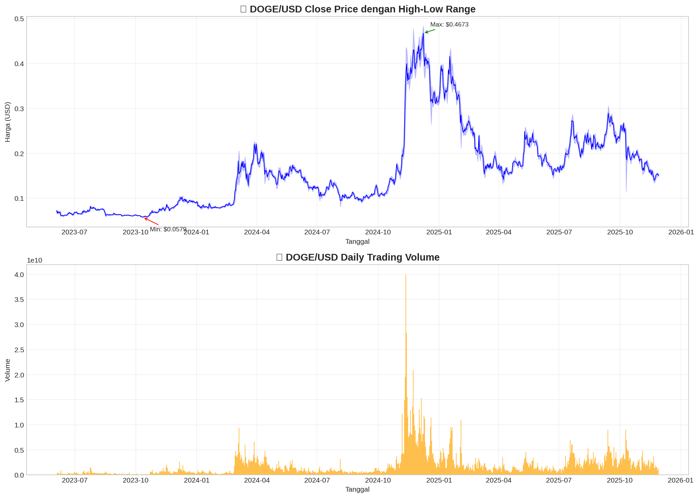
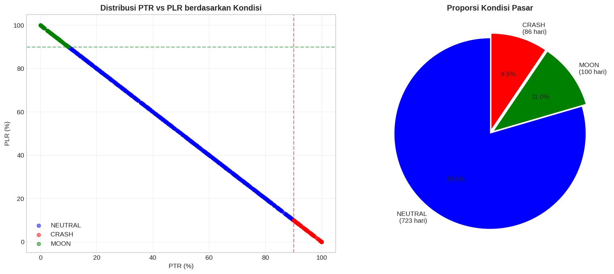
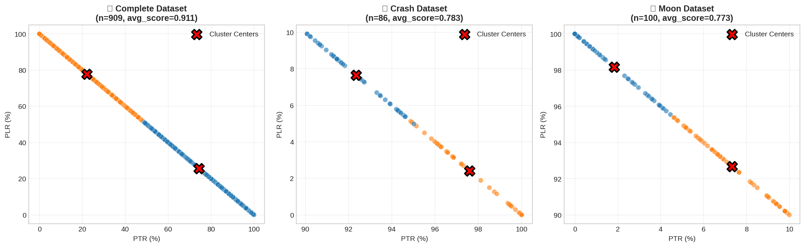
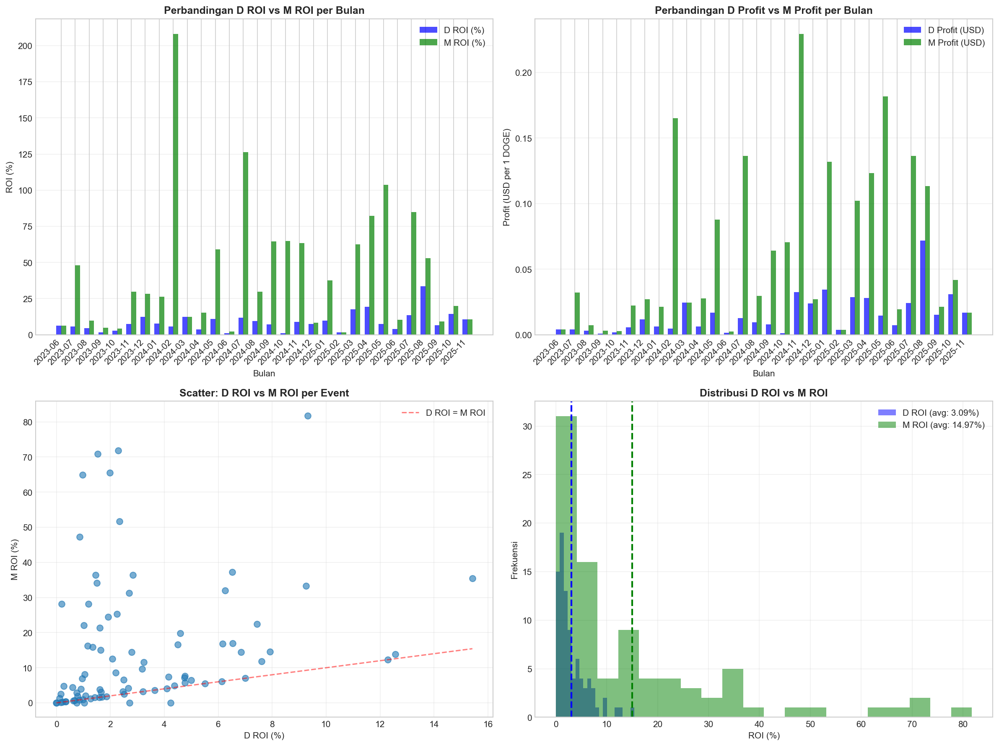
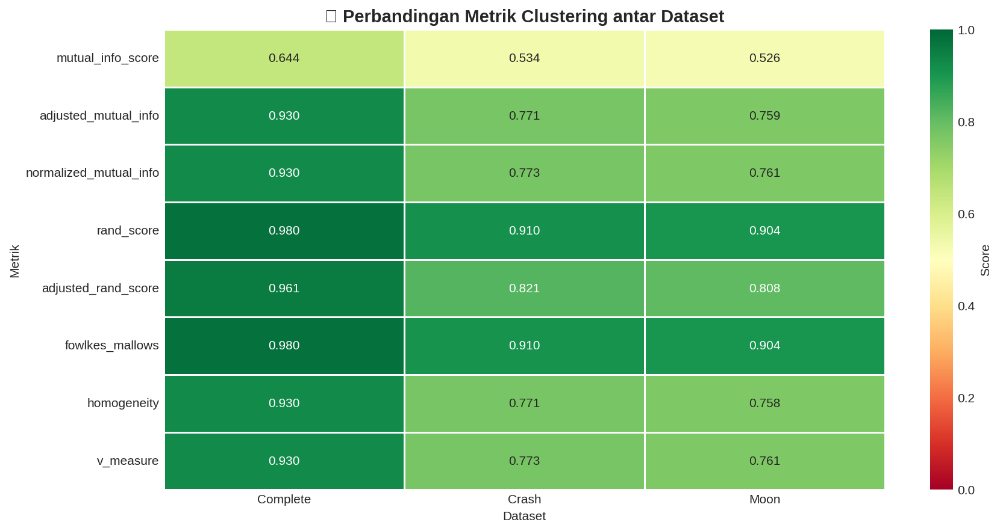
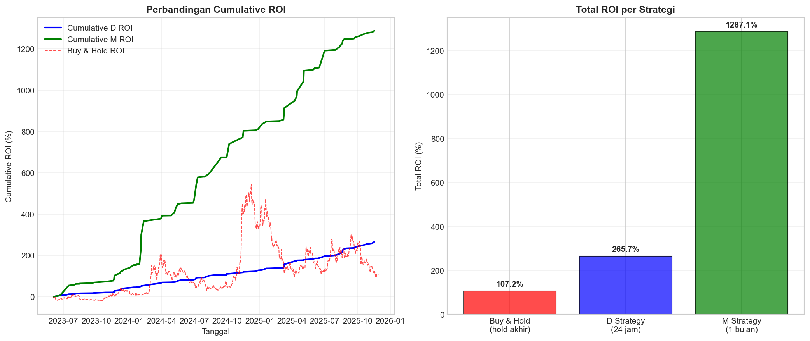

## METHODOLOGY

Penelitian ini menggunakan pendekatan **data mining** dengan kerangka kerja **CRISP‑DM (Cross-Industry Standard Process for Data Mining)**. Seluruh proses diimplementasikan secara terstruktur di dalam notebook Python `DOGE_Patterned_Dataset_CRISPDM.ipynb` sehingga setiap tahap dapat direproduksi dan ditelusuri kembali. Tahapan CRISP‑DM yang dilakukan adalah sebagai berikut.

### 3.1 Business Understanding

Pada tahap ini, fokus penelitian adalah menjawab pertanyaan bisnis:

1. Seberapa besar potensi **profit** dan **return on investment (ROI)** yang dapat diperoleh jika trader membeli DOGE pada saat kondisi **Diamond Crash** (harga mendekati *low* harian)?
2. Apakah **M ROI** (potensi profit maksimum hingga akhir bulan setelah Diamond Crash) secara konsisten lebih besar dibandingkan **D ROI** (potensi profit maksimum hanya dalam 24 jam setelah Diamond Crash)?
3. Seberapa sering peristiwa Diamond Crash muncul dalam satu bulan, dan apakah frekuensi tersebut realistis untuk dijadikan dasar strategi trading historis?

Tujuan teknis dari penelitian ini adalah:

- membangun kembali **Patterned Dataset Model** untuk aset DOGE berdasarkan fitur harian R, TR, LR, PTR, dan PLR;
- mengelompokkan pola harga harian menggunakan **K-means clustering** pada tiga varian patterned dataset (complete, crash, moon);
- mendeteksi peristiwa **Diamond Crash** dan menghitung D ROI serta M ROI untuk setiap peristiwa;
- membandingkan performa strategi *beli saat Diamond Crash* dengan strategi *buy & hold* sederhana.

### 3.2 Data Understanding

Data yang digunakan berupa data historis harga harian DOGE dalam format OHLCV (*open, high, low, close, volume*). Data diunduh secara otomatis melalui API dan disimpan pada berkas `data/raw/doge_ohlc_daily.csv` sebagai *cache* agar proses analisis berikutnya tidak perlu memanggil API berulang kali.

Periode pengamatan mencakup kurang lebih **dua tahun terakhir** hingga tanggal eksekusi notebook, menghasilkan sekitar **909 hari perdagangan** setelah pembersihan awal. Kolom utama yang digunakan adalah:

- `timestamp` : tanggal perdagangan (dalam zona waktu UTC),
- `open`      : harga pembukaan harian,
- `high`      : harga tertinggi harian,
- `low`       : harga terendah harian,
- `close`     : harga penutupan harian,
- `volume`    : volume perdagangan harian.

Eksplorasi awal dilakukan dengan:

- menampilkan `head()`, `info()`, dan `describe()` untuk memastikan kelengkapan tipe data;
- memeriksa nilai hilang (missing values) dan duplikasi `timestamp`;
- memvisualisasikan deret waktu harga penutupan dan volume harian.

Visualisasi utama tahap ini ditampilkan pada:

yang menggambarkan dinamika harga dan volume DOGE selama periode penelitian.

### 3.3 Data Preparation

Tahap ini mengubah data OHLCV harian menjadi **Patterned Dataset** yang lebih informatif untuk mengenali pola crash dan moon.

#### 3.3.1 Pembersihan dan Penyiapan Data

Langkah yang dilakukan:

1. Mengurutkan data berdasarkan `timestamp` secara kronologis.
2. Menghapus baris duplikat berdasarkan `timestamp`.
3. Menghapus baris dengan nilai hilang pada kolom harga atau volume.

Hasil bersih kemudian disalin ke berkas terproses agar dapat digunakan ulang pada eksperimen berikutnya.

#### 3.3.2 Perhitungan Fitur Patterned Dataset

Untuk setiap hari ke‑t, dihitung lima fitur utama Patterned Dataset:

- `R_t  = H_t − L_t` (range harian),
- `TR_t = H_t − C_t` (*top range*),
- `LR_t = C_t − L_t` (*lower range*),
- `PTR_t = TR_t / R_t × 100%` (*percent top range*),
- `PLR_t = LR_t / R_t × 100%` (*percent low range*),

dengan `H_t` harga tertinggi, `L_t` harga terendah, dan `C_t` harga penutupan pada hari ke‑t.

Nilai PTR dan PLR menggambarkan posisi harga penutupan relatif terhadap rentang harian: PTR tinggi berarti penutupan dekat *low*, sedangkan PLR tinggi berarti penutupan dekat *high*. Distribusi kedua fitur ini divisualisasikan pada:

#### 3.3.3 Klasifikasi Kondisi Crash, Moon, dan Neutral

Berdasarkan kombinasi PTR dan PLR, setiap hari diklasifikasikan ke dalam tiga kondisi:

- **Crash**   : `PTR ≥ 90%` dan `PLR ≤ 10%` (penutupan dekat *low* harian),
- **Moon**    : `PLR ≥ 90%` dan `PTR ≤ 10%` (penutupan dekat *high* harian),
- **Neutral** : kondisi lainnya.

Threshold 90% dan 10% dipilih berdasarkan eksplorasi distribusi PTR/PLR pada DOGE; threshold yang terlalu ekstrem (misal 95%/5%) menghasilkan jumlah sinyal terlalu sedikit untuk dianalisis, sedangkan threshold yang terlalu longgar menghasilkan terlalu banyak hari yang diklasifikasikan sebagai crash/moon.

#### 3.3.4 Penyusunan Varian Patterned Dataset dan Normalisasi

Dari hasil pelabelan kondisi, dibentuk tiga varian patterned dataset:

- `df_complete` : seluruh hari pengamatan,
- `df_crash`    : subset hari dengan label crash,
- `df_moon`     : subset hari dengan label moon.

Setiap dataset berisi kolom waktu, harga penutupan, lima fitur Patterned Dataset, serta label kondisi. Untuk keperluan clustering, fitur numerik `[R, TR, LR, PTR, PLR]` kemudian dinormalisasi menggunakan **MinMaxScaler** ke rentang [0, 1] agar tidak ada fitur yang mendominasi jarak Euclidean.

### 3.4 Modeling

Tahap pemodelan (modeling) terdiri dari dua bagian utama: (1) pemodelan pola harga menggunakan K-means clustering, dan (2) pemodelan strategi Diamond Crash melalui perhitungan ROI harian dan bulanan.

#### 3.4.1 K-Means Clustering pada Patterned Dataset

Algoritma **K-means** dengan jumlah cluster `K = 2` diterapkan secara terpisah pada ketiga varian patterned dataset (`complete`, `crash`, dan `moon`). Alur K-means meliputi:

1. Inisialisasi pusat cluster secara acak pada ruang fitur terstandardisasi.
2. Penghitungan jarak Euclidean setiap titik data ke pusat cluster terdekat.
3. Pembaruan pusat cluster sebagai rata‑rata titik di dalam cluster.
4. Pengulangan hingga perubahan pusat cluster berada di bawah ambang konvergensi.

Hasil clustering divisualisasikan dalam dua dimensi (misalnya menggunakan sumbu PTR dan PLR) untuk memberikan gambaran intuitif tentang pemisahan cluster pada masing‑masing patterned dataset:

#### 3.4.2 Deteksi Diamond Crash

Konsep **Diamond Crash** diadaptasi dari penelitian Parlika dkk. [9] dengan modifikasi untuk aset DOGE. Diamond Crash didefinisikan sebagai:

1. Hari tersebut berlabel **crash** (sesuai definisi pada Subbagian 3.3.3), dan
2. Nilai PTR hari tersebut berada pada **persentil ke‑90** di antara seluruh hari crash.

Dengan demikian, hanya hari‑hari crash yang paling ekstrem yang dikategorikan sebagai Diamond Crash. Untuk setiap Diamond Crash dicatat:

- tanggal kejadian,
- harga penutupan saat Diamond Crash (`C_dc`),
- harga maksimum dalam 24 jam setelah Diamond Crash,
- harga maksimum hingga akhir bulan kalender yang sama.

Informasi ini disimpan dalam dataset terpisah (`df_dc_events`) di dalam folder `data/processed/` agar mudah dianalisis ulang.

#### 3.4.3 Perhitungan D ROI dan M ROI

Untuk setiap peristiwa Diamond Crash diasumsikan trader membeli 1 unit DOGE pada harga penutupan hari tersebut (`C_dc`). Dua jenis ROI didefinisikan:

1. **D ROI (Daily ROI)** – potensi profit maksimum dalam 24 jam setelah Diamond Crash:

   \[
   \text{D ROI} = \frac{P_{\text{max\_24h}} - C_{dc}}{C_{dc}} \times 100\%
   \]

   dengan \(P_{\text{max\_24h}}\) adalah harga maksimum yang tercapai dalam jendela waktu 24 jam setelah Diamond Crash.

2. **M ROI (Monthly ROI)** – potensi profit maksimum hingga akhir bulan yang sama:

   \[
   \text{M ROI} = \frac{P_{\text{max\_month}} - C_{dc}}{C_{dc}} \times 100\%
   \]

   dengan \(P_{\text{max\_month}}\) adalah harga maksimum yang tercapai sejak hari Diamond Crash sampai hari terakhir pada bulan kalender tersebut.

Selain ROI per peristiwa, dihitung juga agregat bulanan berupa total profit dan total ROI, serta jumlah peristiwa Diamond Crash per bulan (T_DC). Perbandingan D ROI dan M ROI divisualisasikan pada:

### 3.5 Evaluation

Tahap evaluasi dalam kerangka CRISP‑DM difokuskan pada dua aspek:

1. **Evaluasi teknis clustering**  
   Hasil K-means pada masing‑masing patterned dataset dievaluasi menggunakan delapan metrik eksternal:

   - Mutual Information (MI), Adjusted Mutual Information (AMI), dan Normalized Mutual Information (NMI);
   - Rand Index (RI) dan Adjusted Rand Index (ARI);
   - Fowlkes–Mallows Index (FMI);
   - Homogeneity dan V‑measure.

   Skor‑skor tersebut direkap dalam sebuah tabel dan divisualisasikan dalam bentuk *heatmap*:

   

   sehingga dapat dibandingkan kualitas cluster antara patterned dataset complete, crash, dan moon.

2. **Evaluasi bisnis strategi Diamond Crash**  
   Nilai D ROI dan M ROI yang dihitung untuk seluruh peristiwa Diamond Crash dibandingkan dengan:

   - strategi sederhana *buy & hold* (membeli DOGE di awal periode dan menahan hingga akhir periode);
   - tingkat risiko dan frekuensi kemunculan peristiwa Diamond Crash per bulan.

   Perbandingan kinerja strategi Diamond Crash versus *buy & hold* divisualisasikan pada:

   

   untuk menunjukkan apakah strategi berbasis Diamond Crash memberikan peningkatan ROI yang signifikan secara historis.

### 3.6 Deployment

Tahap terakhir CRISP‑DM adalah *deployment*. Dalam penelitian ini, hasil akhir di-*deploy* dalam bentuk:

- notebook `DOGE_Patterned_Dataset_CRISPDM.ipynb` yang terdokumentasi per tahap CRISP‑DM;
- berkas data mentah dan terproses di folder `data/raw/` dan `data/processed/`;
- visualisasi dan grafik utama di folder `figures/`.

Struktur ini memungkinkan peneliti lain maupun praktisi untuk mengulang seluruh pipeline, mengubah parameter (misalnya threshold PTR/PLR atau nilai K pada K-means), maupun memperpanjang periode data tanpa harus mengulang perancangan dari awal.

---

## RESULTS

Bagian ini menyajikan hasil utama yang diperoleh dari penerapan tahapan CRISP‑DM, khususnya terkait pembentukan patterned dataset, hasil K-means clustering, serta perhitungan D ROI dan M ROI setelah peristiwa Diamond Crash.

### 4.1 Hasil Data Understanding

Eksplorasi awal terhadap data DOGE menunjukkan bahwa:

- data mencakup **sekitar 909 hari** perdagangan berturut‑turut;
- tidak ditemukan nilai hilang pada kolom harga setelah pembersihan;
- volume perdagangan harian bervariasi cukup lebar, dengan beberapa lonjakan tajam yang berkorelasi dengan pergerakan harga yang signifikan.

Grafik deret waktu harga penutupan dan volume pada Gambar 1 (lihat `figures/doge_price_volume_timeseries.png`) memperlihatkan bahwa DOGE mengalami beberapa fase tren naik dan turun yang cukup tajam selama periode penelitian, sehingga cocok untuk dikaji menggunakan pendekatan patterned dataset.

### 4.2 Hasil Penyusunan Patterned Dataset

Transformasi ke Patterned Dataset menghasilkan:

- **hari crash**   : sekitar 86 hari (penutupan dekat *low* harian),
- **hari moon**    : sekitar 100 hari (penutupan dekat *high* harian),
- **hari neutral** : sisa hari dalam periode pengamatan.

Distribusi PTR dan PLR pada Gambar 2 (lihat `figures/ptr_plr_distribution.png`) menunjukkan:

- pada hari crash, PTR terkonsentrasi di atas 90% dan PLR di bawah 10%;
- pada hari moon, PLR dominan di atas 90% dan PTR di bawah 10%;
- pada hari neutral, PTR dan PLR cenderung berada di sekitar 50%.

Hal ini mengindikasikan bahwa definisi threshold PTR/PLR yang digunakan sudah cukup memisahkan hari crash dan moon secara jelas.

### 4.3 Hasil K-Means Clustering

K-means clustering dengan `K = 2` diterapkan pada patterned dataset complete, crash, dan moon. Secara umum diperoleh temuan berikut:

- **Patterned dataset complete** menghasilkan nilai metrik tertinggi, dengan NMI, V‑measure, dan homogeneity rata‑rata berada di kisaran **0,90–0,92**, menunjukkan pemisahan cluster yang sangat baik terhadap label kondisi pasar.
- **Patterned dataset crash** menunjukkan nilai metrik sedikit lebih rendah namun tetap tinggi (NMI dan V‑measure sekitar **0,85–0,88**).
- **Patterned dataset moon** menampilkan pola performa metrik yang mirip dengan dataset crash.

Cluster yang terbentuk cenderung memisahkan:

- cluster dengan volatilitas harian (R) besar dan kombinasi PTR/PLR ekstrem (mewakili kondisi pasar yang sangat bergerak), dan
- cluster dengan volatilitas lebih rendah (pergerakan harga lebih tenang).

Gambar 3 (lihat `figures/kmeans_clustering_comparison.png`) memperlihatkan pemisahan cluster pada ruang fitur PTR dan PLR untuk ketiga varian patterned dataset, sedangkan Gambar 4 (lihat `figures/clustering_metrics_heatmap.png`) menyajikan ringkasan skor delapan metrik clustering.

### 4.4 Hasil Deteksi Diamond Crash

Dengan menggunakan definisi Diamond Crash pada Subbagian 3.4.2, diperoleh sekitar **86 peristiwa Diamond Crash** selama periode pengamatan. Peristiwa ini tersebar cukup merata sepanjang periode, dengan rata‑rata beberapa peristiwa per bulan.

Setiap peristiwa dicatat bersama informasi:

- tanggal Diamond Crash,
- harga penutupan saat entry (`C_dc`),
- harga maksimum dalam 24 jam setelah Diamond Crash,
- harga maksimum hingga akhir bulan.

Ringkasan frekuensi Diamond Crash per bulan kemudian digunakan pada tahap perhitungan ROI dan evaluasi strategi.

### 4.5 Hasil Perhitungan D ROI dan M ROI

Ringkasan statistik D ROI dan M ROI dari seluruh peristiwa Diamond Crash ditunjukkan pada Tabel 1.

**Tabel 1. Ringkasan ROI peristiwa Diamond Crash DOGE**

| Metrik                        | Nilai        |
| ----------------------------- | ------------ |
| Jumlah hari data              | 909 hari     |
| Total Diamond Crash           | 86 peristiwa |
| Rata‑rata D ROI per peristiwa | 3,09%        |
| Rata‑rata M ROI per peristiwa | 14,97%       |
| Akumulasi D ROI               | 265,74%      |
| Akumulasi M ROI               | 1287,09%     |
| Rasio M ROI terhadap D ROI    | 4,84×        |

Secara visual, Gambar 5 (lihat `figures/roi_comparison.png`) menunjukkan bahwa:

- pada sebagian besar bulan, **M ROI** secara signifikan lebih tinggi dibandingkan **D ROI**;
- terdapat beberapa bulan di mana kenaikan harga tertinggi justru terjadi dalam 24 jam pertama, namun secara agregat M ROI tetap mendominasi.

Perbandingan strategi Diamond Crash dengan strategi *buy & hold* pada Gambar 6 (lihat `figures/strategy_comparison.png`) memperlihatkan bahwa strategi Diamond Crash berpotensi menghasilkan ROI kumulatif yang lebih besar, meskipun bergantung pada frekuensi dan distribusi peristiwa Diamond Crash.

---

## DISCUSSION

### 5.1 Analisis Kualitas Clustering dalam Kerangka CRISP‑DM

Dalam perspektif CRISP‑DM, hasil K-means clustering merepresentasikan tahap **modeling** yang bertujuan memahami struktur pola harga DOGE berdasarkan Patterned Dataset. Temuan bahwa patterned dataset **complete** memberikan skor metrik tertinggi (NMI dan V‑measure sekitar 0,9) menunjukkan bahwa:

1. Informasi kondisi crash, moon, dan neutral secara bersama‑sama memberikan konteks yang lebih kaya dibandingkan hanya fokus pada satu subset (misalnya hanya crash).
2. Pola volatilitas DOGE bersifat menyeluruh dan tidak hanya terbatas pada hari‑hari ekstrem; cluster yang stabil membutuhkan gabungan seluruh kondisi pasar.

Hal ini sedikit berbeda dengan hasil penelitian sebelumnya pada BTC yang menekankan keunggulan patterned dataset crash [9]. Perbedaan tersebut dapat dijelaskan oleh karakter DOGE yang sangat dipengaruhi sentimen komunitas dan media sosial, sehingga pola pergerakan harga ekstrem sering “menular” ke hari‑hari non‑ekstrem di sekitarnya.

### 5.2 Implikasi Strategi Diamond Crash terhadap ROI

Dalam tahap **evaluation** dan **business understanding**, fokus analisis bergeser pada interpretasi nilai D ROI dan M ROI:

- Rata‑rata D ROI per peristiwa sekitar 3,09% dengan akumulasi 265,74% mengindikasikan bahwa strategi cepat (take profit dalam 24 jam) bisa memberikan peluang keuntungan, tetapi terbatas.
- Rata‑rata M ROI per peristiwa sekitar 14,97% dengan akumulasi 1287,09% dan rasio M ROI terhadap D ROI sebesar 4,84× menunjukkan bahwa **menahan posisi hingga akhir bulan setelah Diamond Crash secara historis jauh lebih menguntungkan** dibandingkan hanya mengincar kenaikan harga jangka sangat pendek.

Dari sudut pandang trader, temuan ini menyiratkan bahwa:

1. Diamond Crash dapat dipandang sebagai sinyal *entry* dengan potensi *swing trade* sampai beberapa minggu, bukan sekadar *scalping* intrahari.
2. Frekuensi Diamond Crash yang hanya beberapa kali per bulan menuntut kesabaran dan disiplin dalam menunggu sinyal, tetapi juga membantu membatasi *overtrading*.

Namun demikian, semua hasil ROI di sini merupakan **batas atas teoritis** karena belum memasukkan biaya transaksi, *slippage*, serta keterbatasan eksekusi pada harga maksimum historis. Oleh karena itu, strategi Diamond Crash lebih tepat dipandang sebagai **konsep dasar** yang masih perlu diterjemahkan ke dalam aturan trading dan manajemen risiko yang rinci sebelum digunakan pada perdagangan riil.

### 5.3 Keterbatasan dan Peluang Pengembangan

Beberapa keterbatasan penelitian yang perlu dicatat:

1. **Biaya transaksi dan slippage diabaikan**  
   Dalam praktik, setiap transaksi beli dan jual DOGE akan dikenai biaya, dan harga realisasi bisa berbeda dari harga historis (slippage). Memasukkan faktor ini kemungkinan akan menurunkan ROI aktual.

2. **Tidak ada manajemen risiko eksplisit**  
   Simulasi tidak menggunakan *stop loss*, *take profit* bertingkat, maupun alokasi modal dinamis. Seluruh perhitungan diasumsikan berbasis 1 unit DOGE per peristiwa Diamond Crash.

3. **Threshold PTR/PLR belum divariasikan secara sistematis**  
   Studi ini menggunakan threshold tetap (90%/10%). Eksperimen sensitivitas dengan threshold lain (misalnya 85%/15% atau 95%/5%) berpotensi memberikan wawasan tentang stabilitas performa strategi.

4. **Jumlah cluster K masih tetap**  
   Nilai K pada K-means ditetapkan 2 tanpa eksplorasi sistematis terhadap K alternatif (misalnya dengan *elbow method* atau *silhouette score*).

5. **Tidak ada model prediktif waktu ke depan**  
   Penelitian ini masih bersifat deskriptif‑eksploratif terhadap pola historis. Pengembangan model prediktif (misalnya LSTM, GRU, atau ConvLSTM2D) untuk memprediksi kemunculan Diamond Crash sebelum kejadian merupakan peluang riset lanjutan.

Meskipun demikian, kerangka CRISP‑DM yang digunakan telah memberikan alur yang jelas dari pemahaman masalah bisnis, pengolahan data, pemodelan, hingga evaluasi, sehingga memudahkan perluasan penelitian di masa mendatang.

---

## CONCLUSION

Penelitian ini mengadaptasi **Patterned Dataset Model** dan kerangka **CRISP‑DM** untuk menganalisis pola harga DOGE dan mengevaluasi potensi keuntungan strategi *beli saat Diamond Crash*. Data historis harga harian DOGE diolah menjadi Patterned Dataset dengan fitur R, TR, LR, PTR, dan PLR, kemudian diklasifikasikan ke dalam kondisi crash, moon, dan neutral.

Pada tahap **modeling**, algoritma **K-means clustering** (K = 2) diaplikasikan pada tiga varian patterned dataset (complete, crash, moon). Hasil evaluasi menunjukkan bahwa patterned dataset **complete** memberikan kualitas cluster terbaik dengan nilai metrik seperti NMI dan V‑measure sekitar 0,9, menandakan pemisahan pola harga yang cukup jelas dalam konteks kondisi pasar DOGE.

Deteksi **Diamond Crash** berdasarkan kombinasi label crash dan nilai PTR pada persentil ke‑90 menghasilkan sekitar 86 peristiwa sepanjang periode pengamatan. Untuk setiap peristiwa dihitung **D ROI** (dalam 24 jam) dan **M ROI** (hingga akhir bulan). Rata‑rata D ROI per peristiwa sebesar 3,09% dengan akumulasi 265,74%, sedangkan rata‑rata M ROI sebesar 14,97% dengan akumulasi 1287,09%. Rasio M ROI terhadap D ROI sekitar 4,84× menunjukkan bahwa **secara historis, strategi menahan DOGE hingga akhir bulan setelah Diamond Crash memberikan potensi keuntungan yang jauh lebih tinggi** dibandingkan sekadar mengejar kenaikan harga dalam 24 jam pertama.

Secara keseluruhan, penerapan CRISP‑DM dalam penelitian ini berhasil:

- memformulasikan masalah bisnis ke dalam pertanyaan riset yang terukur,
- menyusun pipeline pengolahan data dan Patterned Dataset yang sistematis,
- membangun dan mengevaluasi model clustering,
- serta mengkaji kelayakan awal strategi Diamond Crash dari sisi ROI.

Untuk pengembangan lanjutan, penelitian dapat diarahkan pada:

- memasukkan biaya transaksi, slippage, dan aturan manajemen risiko sehingga simulasi ROI lebih mendekati kondisi pasar riil;
- mengeksplorasi variasi threshold PTR/PLR dan jumlah cluster K;
- menggabungkan Patterned Dataset dengan model prediktif berbasis deep learning untuk memprediksi kemunculan Diamond Crash beberapa hari sebelumnya.

Dengan demikian, hasil penelitian ini diharapkan dapat menjadi dasar bagi pengembangan strategi trading DOGE berbasis pola harga historis yang lebih matang dan terukur.
